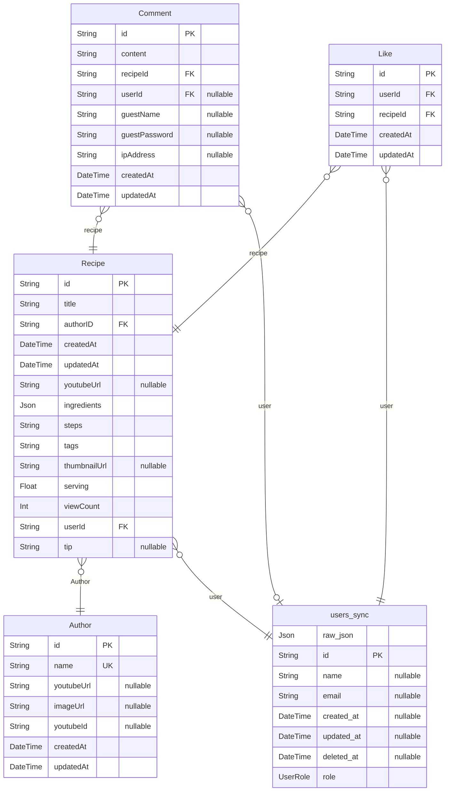

# Recipe

> Generated by [`prisma-markdown`](https://github.com/samchon/prisma-markdown)

- [default](#default)

## default

### `users_sync`

**Properties**

- `raw_json`:
- `id`:
- `name`:
- `email`:
- `created_at`:
- `updated_at`:
- `deleted_at`:
- `role`:

### `Author`

**Properties**

- `id`:
- `name`:
- `youtubeUrl`:
- `imageUrl`:
- `youtubeId`:
- `createdAt`:
- `updatedAt`:

### `Comment`

**Properties**

- `id`:
- `content`:
- `recipeId`:
- `userId`:
- `guestName`:
- `guestPassword`:
- `ipAddress`:
- `createdAt`:
- `updatedAt`:

### `Like`

**Properties**

- `id`:
- `userId`:
- `recipeId`:
- `createdAt`:
- `updatedAt`:

### `Recipe`

**Properties**

- `id`:
- `title`:
- `authorID`:
- `createdAt`:
- `updatedAt`:
- `youtubeUrl`:
- `ingredients`:
- `steps`:
- `tags`:
- `thumbnailUrl`:
- `serving`:
- `viewCount`:
- `userId`:
- `tip`:
